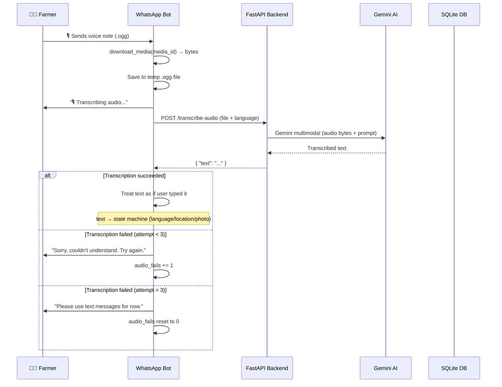
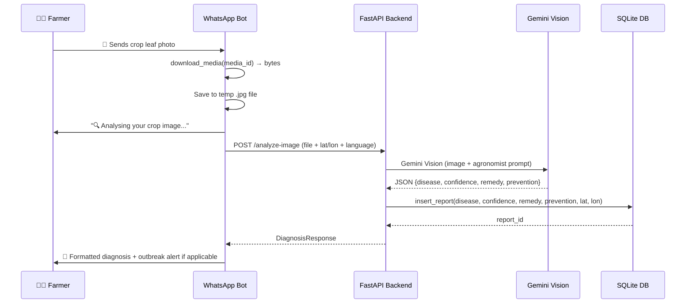
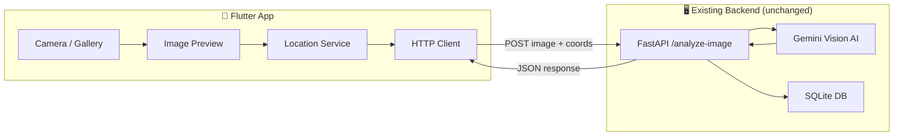

# CropRadar: Audio/Image Flow Explanation & Flutter Backup App Plan

## 1. Current Audio Communication Flow

Here's what happens when a farmer uses **voice notes** on WhatsApp (or Telegram):

### Key Details:
- **Audio is converted to text**, then fed into the same state machine as typed messages
- Audio works at **any state** — language selection ("1" or "2"), location ("12.97, 77.59"), or general commands
- The **retry mechanism**: 3 failed transcriptions → forced text fallback, counter resets
- Audio does **NOT** work for sending images — it's transcription only

---

## 2. Current Image/Photo Flow

### Two ways the image can be "explained":
1. **Send photo on WhatsApp** → AI analyzes it → structured diagnosis returned
2. **Send voice note describing the problem** → Transcribed to text → but this does NOT trigger image analysis (it only becomes text input to the state machine)

> [!IMPORTANT]
> Audio describing a leaf issue does NOT trigger vision analysis. The farmer **must** send an actual photo for Gemini Vision to diagnose it. Audio only converts speech → text.

---

## 3. The Problem: Meta Developer Account Blocked

As shown in your screenshot, Meta's "Verify Your Account" step is returning:
> *"Sorry, a temporary error has occurred. Please try again in a little while."*

This has persisted 2+ hours, meaning you **cannot** provision a WhatsApp Business phone number, and the WhatsApp bot is non-functional until Meta resolves this.

---

## 4. Flutter Backup App — Proposed Solution

Build a standalone **Flutter mobile app** that replaces the WhatsApp frontend entirely, connecting directly to the existing FastAPI backend.

### Architecture

> [!TIP]
> The **entire backend stays unchanged**. The Flutter app simply replaces WhatsApp as the image sender, talking to the same `/analyze-image` endpoint.

### App Features

| Feature | Description |
|---------|-------------|
| 📸 **Camera Scan** | Open camera, capture crop leaf photo |
| 🖼️ **Gallery Pick** | Select existing photo from phone gallery |
| 📍 **Auto Location** | GPS auto-capture via `geolocator` package |
| 🌐 **Language Toggle** | English / ಕನ್ನಡ switch |
| 🔍 **Diagnosis Display** | Disease name, confidence (🔴🟡🟢), remedy, prevention |
| 📊 **Report History** | List of past diagnoses from `/reports` endpoint |
| ⚠️ **Outbreak Alerts** | Check `/nearby-alerts` on app launch |

### Tech Stack

| Layer | Technology |
|-------|-----------|
| Framework | Flutter 3.x (Dart) |
| HTTP | `http` or `dio` package |
| Camera | `image_picker` package |
| Location | `geolocator` + `geocoding` |
| State | `provider` or simple `StatefulWidget` |
| Design | Material Design 3 with green/agriculture theme |

---

## Proposed Changes

### [NEW] `d:\Z-work\CropRadar\CropRadar-01\cropradar_app\`

A new Flutter project directory with:

#### [NEW] `lib/main.dart`
- App entry point, Material 3 theme (dark green agriculture palette)
- Root `MaterialApp` with routes

#### [NEW] `lib/screens/home_screen.dart`
- Main screen with camera/gallery buttons
- Auto-location capture on launch
- Language selector (EN / KN)
- Outbreak alert banner if nearby risks detected

#### [NEW] `lib/screens/diagnosis_screen.dart`
- Shows the AI diagnosis result
- Disease name, confidence with color coding, remedy, prevention
- Report ID confirmation
- "Scan Another" button

#### [NEW] `lib/screens/history_screen.dart`
- Fetches `/reports` and displays in a scrollable list
- Filter by disease type or date

#### [NEW] `lib/services/api_service.dart`
- `analyzeImage(File image, double lat, double lon, String lang)` → calls `POST /analyze-image`
- `getNearbyAlerts(double lat, double lon)` → calls `GET /nearby-alerts`
- `getReports()` → calls `GET /reports`
- Configurable base URL (localhost for dev, ngrok/deployed URL for production)

#### [NEW] `lib/services/location_service.dart`
- Request GPS permissions
- Get current lat/lon
- Fallback to manual coordinate entry

#### [NEW] `lib/widgets/` (shared components)
- `diagnosis_card.dart` — Reusable diagnosis result card
- `language_toggle.dart` — EN/KN switch widget
- `outbreak_banner.dart` — Alert banner widget

---

## Open Questions

> [!IMPORTANT]
> **1. Backend URL:** When testing the Flutter app, will the FastAPI backend be running locally on your machine? If so, on which port (default: 8000)? For Android emulator, we'd use `10.0.2.2:8000`; for a physical phone on the same WiFi, your machine's local IP.

> [!IMPORTANT]
> **2. Target platforms:** Should this be Android-only for now, or both Android + iOS?

> [!WARNING]
> **3. Flutter SDK:** Do you have Flutter SDK installed? If not, I'll include setup instructions. Run `flutter --version` to check.

> [!NOTE]
> **4. Deployment for demo:** For a quick demo without ngrok, we can bundle the API URL as a configurable setting in the app. Want me to add a settings screen for that?

---

## Verification Plan

### Automated Tests
1. `flutter analyze` — No lint errors
2. `flutter build apk --debug` — Successful APK build
3. Manual test: Launch app → take photo → verify diagnosis appears

### Manual Verification
1. Start FastAPI backend: `uvicorn api:app --host 0.0.0.0 --port 8000`
2. Launch Flutter app on physical device / emulator
3. Capture a leaf image → confirm diagnosis response
4. Check `cropradar.db` to verify the report was inserted
